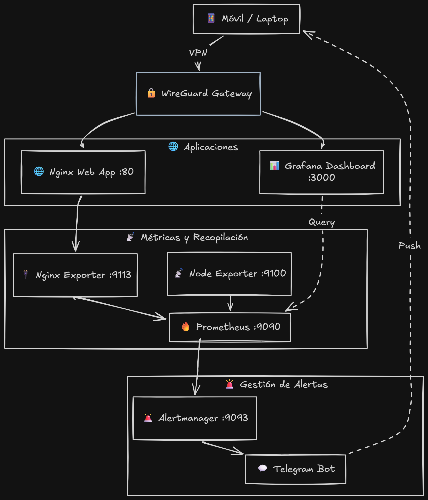
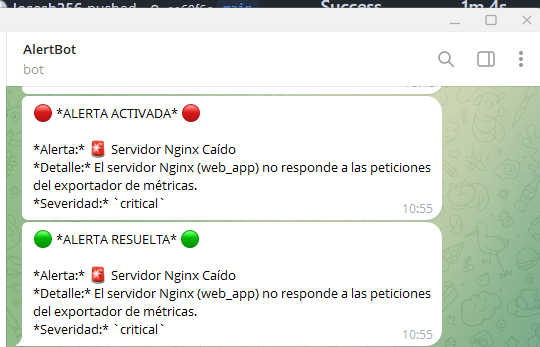

# Observability & Secure VPN Stack (Docker + WireGuard)

Este es un template modular e inteligente de observabilidad y VPN seguro, diseñado para poder ser acoplado a **cualquier proyecto** de manera extremadamente sencilla.



## Componentes del Stack
- **WireGuard (WG-Easy)**: Gateway VPN seguro con panel web de administración para gestionar clientes, descargar configuraciones y ver códigos QR de forma visual.
- **Nginx**: Servidor web principal que sirve una moderna landing page personalizable en HTML5/CSS3.
- **Node Exporter**: Genera métricas detalladas de rendimiento a nivel de kernel/sistema de la máquina host.
- **Prometheus**: Base de datos de series temporales configurada para recolectar las métricas de rendimiento automáticamente.
- **Grafana**: Panel de control visual pre-configurado para pintar el consumo de CPU, memoria, carga de sistema y red en tiempo real.

---

## Estructura del Proyecto

```text
DockerObservability/
├── .env.example          # Plantilla para tus variables de entorno locales
├── .gitignore            # Excluye datos de base de datos y llaves privadas de la VPN
├── docker-compose.yml    # Definición modular de contenedores Docker
├── setup.ps1             # Script inteligente para Windows (PowerShell)
├── setup.sh              # Script inteligente para Linux/macOS (Bash)
├── README.md             # Esta guía de usuario
├── apps/                 # AQUÍ COLOCAS TU APLICACIÓN O API
│   └── web/
│       ├── nginx.conf    # Configuración de Nginx
│       └── html/
│           └── index.html # Página web estática inicial
├── monitoring/           # ARCHIVOS DE MONITORIZACIÓN AUTOMÁTICA
│   ├── prometheus/
│   │   └── prometheus.yml
│   └── grafana/
│       └── provisioning/ # Auto-carga de datasources y dashboards
└── vpn/
    └── config/           # Datos persistentes de la VPN (Generados automáticamente)
```

---

## Guía de Configuración Rápida

### 1. Preparar el Entorno
1. Clona o descarga este repositorio en tu máquina.
2. Copia el archivo de ejemplo para crear tu entorno local:
   ```bash
   cp .env.example .env
   ```
3. *(Opcional)* Edita el archivo `.env` para cambiar tus puertos preferidos, IP de conexión o la clave de administración.

### 2. Cómo Ejecutar (Automático y Desatendido)

Los scripts incluidos validan de forma inteligente si los puertos configurados en el `.env` están ocupados. Si detectan que un puerto está en uso, **buscan el siguiente libre, actualizan el archivo `.env` automáticamente y levantan el stack**.

#### En Windows (PowerShell con permisos):
```powershell
.\setup.ps1
```

#### En Linux / macOS (Bash):
```bash
chmod +x setup.sh
./setup.sh
```

Una vez completado el script, verás en pantalla los enlaces directos de acceso local:
* **Web App (Nginx)**: `http://localhost:8080`
* **Grafana (Dashboards)**: `http://localhost:3000` *(usuario `admin` / clave `admin`)*
* **Prometheus**: `http://localhost:9090`
* **WireGuard UI (Panel)**: `http://localhost:51821` *(clave `admin`)*

---

## Cómo Adaptarlo a tu Propio Proyecto

Este stack está pensado para ser reutilizado en cualquier desarrollo futuro:

1. **Sustituir la Aplicación Web**:
   * Si tienes un frontend estático (HTML/JS/React compilado), solo reemplaza los archivos dentro de la carpeta `apps/web/html/` con tus propios ficheros.
   * Si tienes una API o aplicación backend en Python, Node, Go, etc., agrégala a tu `docker-compose.yml` y reemplaza el servicio de Nginx o configúralo como proxy pass.

2. **Añadir más Métricas al Stack**:
   Puedes añadir cualquier otro exportador a la red de Docker (ej: `postgres-exporter` o `redis-exporter`) y añadir sus endpoints de escaneo en `monitoring/prometheus/prometheus.yml` para recopilarlos en el mismo Prometheus.

---

## Acceso Seguro vía WireGuard

Cuando levantas el stack por primera vez, puedes entrar al panel web de administración de WireGuard en `http://localhost:51821` para añadir nuevos clientes.

* Podrás ver y escanear el código QR directamente en tu móvil usando la aplicación de WireGuard.
* También puedes descargar el fichero `.conf` para importarlo en tu portátil.
* **Nota para testing local (Wi-Fi)**: Si pruebas la conexión VPN desde tu móvil dentro de la misma red local Wi-Fi, edita los ajustes del túnel importado en tu móvil y cambia el campo **Allowed IPs** (IPs permitidas) de `0.0.0.0/0` a `10.8.0.0/24` para habilitar el *Split Tunneling* y evitar perder tu conexión a internet general.
* **Seguridad en la Nube (VPS)**: Si despliegas este stack en un servidor en la nube (AWS, DigitalOcean, etc.), el único puerto que debes dejar abierto al público en el firewall del proveedor es el **`51820` (UDP)** de WireGuard. Todos los demás puertos (`8080`, `3000`, `9090`, `51821`) deben permanecer **cerrados** al público exterior, garantizando que solo los usuarios conectados a la VPN puedan acceder a ellos.

---

## 📸 Captura de Alertas en Telegram

Ejemplo real de las notificaciones que envía Prometheus y Alertmanager automáticamente a Telegram al caerse un servicio y su posterior resolución:



